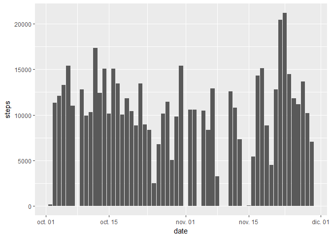
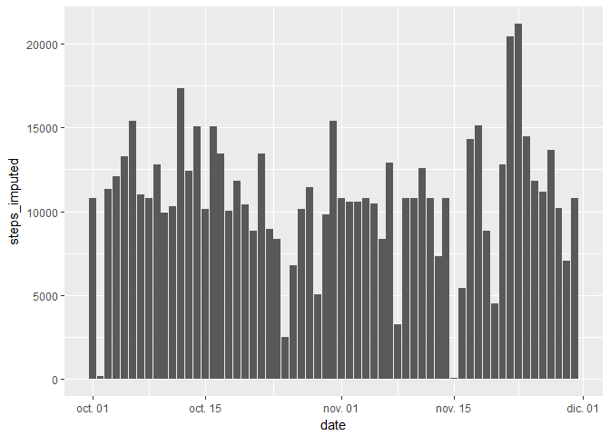
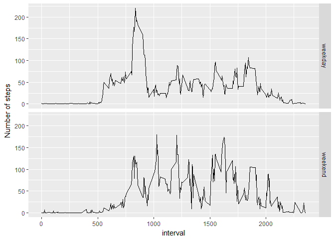

```r
knitr::opts_chunk$set(fig.path='assign1_figs/', echo=TRUE, warning=FALSE, message=FALSE)
```

## Loading and preprocessing the data
1. Load the data

```r
if (!file.exists("data")) {
  dir.create("data")
}
unzip("./activity.zip", exdir = "./data")
activity <-read.csv("./data/activity.csv")
```

2. Process/transform the data (if necessary) into a format suitable for the analysis

```r
library(lubridate)
library(ggplot2)
library(dplyr)
activity$date <- ymd(activity$date)
```

## What is mean total number of steps taken per day?
For this part of the assignment, ignore the missing values in the dataset.

1. Histogram of the total number of steps taken each day

```r
with (activity, qplot(date, steps, geom = "col"))
```

<!-- -->

2. Calculate and report the mean and median total number of steps taken per day

```r
mean(with(activity, tapply(steps, date, sum, na.rm = TRUE)))
```

```
## [1] 9354.23
```

```r
median(with(activity, tapply(steps, date, sum, na.rm = TRUE)))  
```

```
## [1] 10395
```

## What is the average daily activity pattern?
1. Time series plot of the 5-minute interval (x-axis) and the average number of steps taken, averaged across all days (y-axis)

```r
activitymean_byinterval <- activity %>%
  group_by(interval) %>%
  summarise(steps=mean(steps,na.rm = TRUE)) %>%
  ungroup()
```

```r
with (activitymean_byinterval, qplot(interval, steps, geom="line"))
```

<!-- -->

2. Which 5-minute interval, on average across all the days in the dataset, contains the maximum number of steps?

```r
as.numeric(activitymean_byinterval[max(activitymean_byinterval$steps),1])
```

```
## [1] 1705
```

## Imputing missing values
1. Total number of missing values in the dataset (i.e. the total number of rows with NAs)

```r
sapply(activity, function(x) sum(is.na(x)))
```

```
##    steps     date interval 
##     2304        0        0
```

2. Strategy for filling in all of the missing values in the dataset: use the mean for that 5-minute interval.
3. Create a new dataset that is equal to the original dataset but with the missing data filled in.

```r
activity_imputation <- activity %>%
  group_by(interval) %>%
  mutate(steps_imputed = ifelse (is.na(steps) == TRUE, mean(steps, na.rm = TRUE), steps)) %>%
  ungroup()
```

4. Histogram of the total number of steps taken each day and Calculate and report the mean and median total number of steps taken per day. Do these values differ from the estimates from the first part of the assignment? What is the impact of imputing missing data on the estimates of the total daily number of steps?

```r
with (activity_imputation, qplot(date, steps_imputed, geom = "col"))
```

<!-- -->

```r
mean(with(activity_imputation, tapply(steps_imputed, date, sum, na.rm = TRUE)))
```

```
## [1] 10766.19
```

```r
median(with(activity_imputation, tapply(steps_imputed, date, sum, na.rm = TRUE)))
```

```
## [1] 10766.19
```

## Are there differences in activity patterns between weekdays and weekends?

1. Create a new factor variable in the dataset with two levels -- "weekday" and "weekend" indicating whether a given date is a weekday or weekend day.

```r
activity_imputation <- activity_imputation %>%
  mutate(weekend = ifelse (weekdays(date, abbreviate = TRUE) == "sa.", "weekend",
                           ifelse (weekdays(date, abbreviate = TRUE) == "do.", "weekend",
                                   "weekday")))
```

2. panel plot a time series plot (i.e. type = "l") of the 5-minute interval (x-axis) and the average number of steps taken, averaged across all weekday days or weekend days (y-axis).

```r
activityimputedmean_byinterval <- activity_imputation %>%
  group_by(interval, weekend) %>%
  summarise(steps_imputed=mean(steps_imputed)) %>%
  ungroup()
with (activitymean_byinterval, qplot(interval, steps, geom="line"))
```

<!-- -->

```r
ggplot(activityimputedmean_byinterval, aes(interval,steps_imputed)) + geom_line() + facet_grid(weekend ~.) + ylab("Number of steps")
```

<!-- -->
